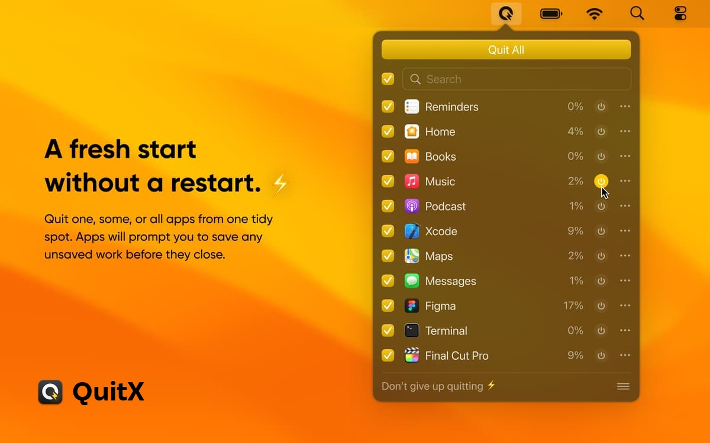
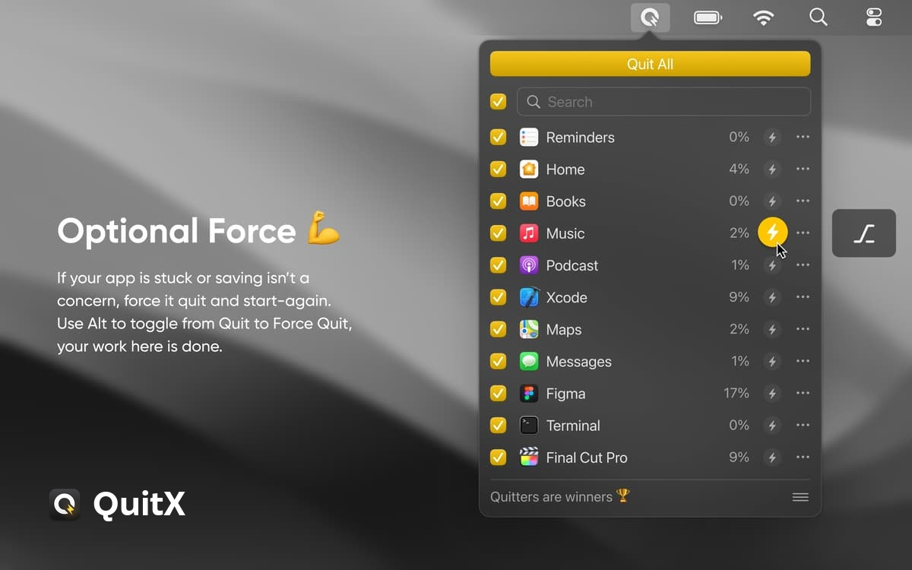
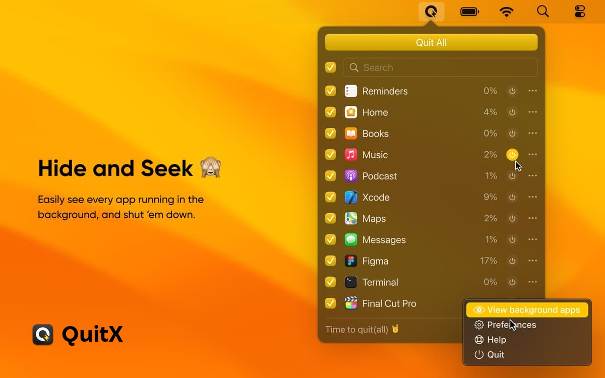
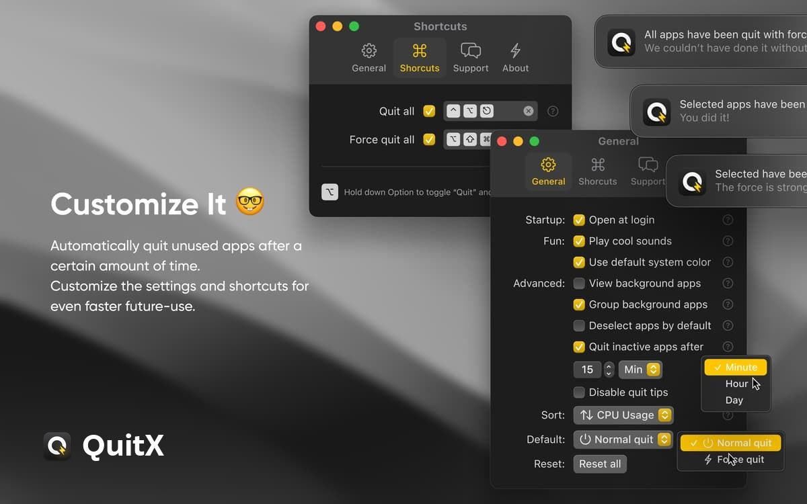

<p align="center">
  
</p>

<h1 align="center">QuitX for macOS</h1>

<p align="center">
  Fast, minimal menubar companion to quit, force quit, and manage running macOS apps.
</p>

<p align="center">
  <a href="https://github.com/kiron0/quitx/actions/workflows/ci.yml"></a>
  
  
  <a href="LICENSE"></a>
</p>

<p align="center">
  <a href="https://github.com/kiron0/quitx/releases/latest">
    
  </a>
</p>

---

## Preview

<p align="center">
  
</p>

<table width="100%">
  <tr>
    <td width="50%">
      
      <p align="center"><strong>Force Quit Mode</strong><br/><sub>Hold <kbd>⌥ Option</kbd> to toggle all actions to force quit.</sub></p>
    </td>
    <td width="50%">
      
      <p align="center"><strong>Background Processes</strong><br/><sub>Inspect and terminate hidden background processes.</sub></p>
    </td>
  </tr>
  <tr>
    <td colspan="2">
      
      <p align="center"><strong>Preferences & Shortcuts</strong><br/><sub>Configure auto-quit timers, exclusions, global shortcuts, and audio cues.</sub></p>
    </td>
  </tr>
</table>

---

## Install

1. Download the latest `.dmg` above.
2. Drag **QuitX** into `/Applications`.
3. Launch from Applications or Spotlight. It lives in your menu bar.

---

## CLI Companion

QuitX also includes a Node-based terminal CLI:

```bash
npm install -g @coreify/quitx
quitx
```

The macOS app stores preferences independently in standard `UserDefaults` (`com.quitx.QuitX`).

---

## License

MIT © [Toufiq Hasan Kiron](https://github.com/kiron0)
